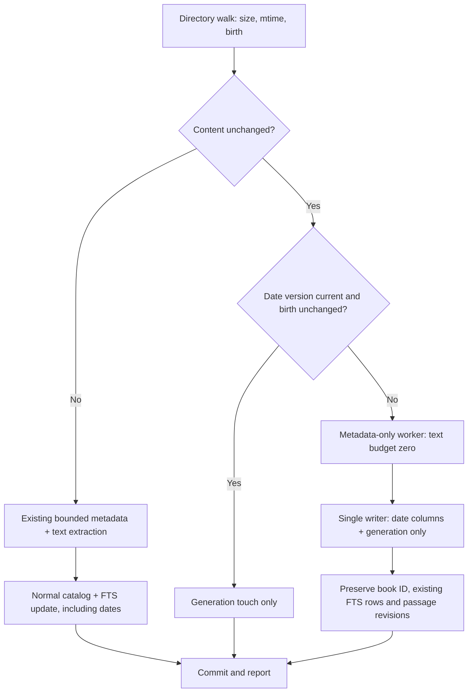

# Book dates: shelf, indexing and MCP reference

Implemented in the development tree on 2026-09-23. No publication date is
invented and no source EPUB/PDF is edited. This is an additive catalog feature;
the launch descriptor and seven-tool MCP profile remain compatible.

## What the three columns mean

| Visible column | Source | Precision / unknown behavior | Important distinction |
|---|---|---|---|
| PUBLISHED | EPUB Dublin Core `dc:date` (explicit publication event preferred, then unqualified date); PDF XMP Dublin Core `dc:date` | `YYYY`, `YYYY-MM`, or `YYYY-MM-DD`, retaining supplied precision; `Unknown` if absent, malformed, or unavailable | Describes the edition's metadata, not verified first publication. Never inferred from filename, text, file birth, PDF `CreationDate`, or XMP `CreateDate`. |
| FILE CREATED | Filesystem birth time (`st_birthtime_ns`, then birthtime; Windows legacy `st_ctime_ns` fallback) | Shelf: local calendar date and time; API: integer Unix nanoseconds plus UTC ISO timestamp; null/Unknown when unavailable | Copying/restoring files can reset birth time. This is **not the date added to Lumen**. POSIX inode-change time is never substituted. |
| FILE MODIFIED | Filesystem `st_mtime_ns` from the sweep's directory entry | Shelf: local calendar date and time; API: Unix nanoseconds plus UTC ISO timestamp | Filesystem timestamp, not the release year or time indexed. |

The shelf always paints the values; tooltips supplement them with provenance.
Wide windows show date columns beside title, author and original path. Narrow
windows move the three aligned cells below the book identity, preserving its
path and text snippet. Cards remain virtualized and paged (400 rows per page),
not a widget per book. Night, Paper and Sepia palettes style the new controls.

## Using the shelf

1. Run **Sweep this folder now** after upgrading. Modified dates are available
   immediately from older catalog rows; publication and birth dates need the
   first upgraded sweep.
2. Click a date-column heading for newest first, again for oldest first.
   Unknown values stay last in either direction. Ties use stable book IDs.
   Publication sort uses the earliest possible day of the supplied year/month.
3. Choose a date field, enter From and/or Through, and click **Apply dates**.
   Publication accepts a year, month or day. File ranges accept a UTC calendar
   day or an ISO timestamp with timezone. One selected field is active in the
   shelf; MCP can combine all three. Clear dates removes the range restriction.
4. Text search and format chips remain active with date ranges and sorting.
   **BOOK / ORIGINAL FILE** restores title order. Invalid dates or reversed
   ranges produce a visible message and leave the previous valid filter intact.

Display timezone and query timezone are deliberately explicit. For example,
`2024-06-15T01:00:00Z` can display on June 14 in a negative UTC offset. Local
display does not silently shift the UTC search boundary.

## Storage and safe upgrade

| Catalog field | SQLite type/default | Purpose |
|---|---|---|
| `published_date` | TEXT, empty string | Display value retaining source precision |
| `published_start` | TEXT, NULL | Earliest possible ISO day |
| `published_end` | TEXT, NULL | Latest possible ISO day |
| `publication_source` | TEXT, empty string | `epub:dc:date` or `pdf:xmp:dc:date` |
| `created_ns` | INTEGER, NULL | Filesystem birth instant |
| `mtime_ns` | Existing INTEGER | Filesystem modification instant, unchanged contract |
| `date_metadata_version` | INTEGER, 0 | 0 = pending upgrade; 1 = attempted by current extractor, including valid unknown publication |

`LibraryIndex._migrate` adds missing columns before creating indexes. Four
ordinary B-tree indexes cover `(root,published_start,id)`,
`(root,published_end,id)`, `(root,created_ns,id)` and `(root,mtime_ns,id)`.
Dates are **not FTS tokens**; SQL binds range values and applies them before
ranking/candidate limits. No additional package, GPU kernel, model, OCR, web
lookup, or DirectStorage requirement is introduced.



The first upgrade opens each otherwise unchanged book only for metadata. EPUB
spine prose and PDF page text are not read for that backfill. Per-book
savepoints, bounded multiprocessing queues, batched commits, cancellation,
disk safeguards, existing monitor counters and WAL policy remain in use.
If a metadata-only read fails, the old identity/text is retained and the pending
date version is retried next sweep. A successfully read book without a publication
date is marked attempted; unknown publication does not cause endless backfills.
File changes still follow the ordinary full incremental-extraction path.

MCP remains read-only. It does not migrate the index or start a sweep as a side
effect of a query. An old unmigrated index still supports ordinary queries;
new publication/birth filters or sorts return `DATE_INDEX_REQUIRED` with upgrade
instructions. Once columns exist, missing values remain unknown until swept.

## GPU, CPU-only and DirectStorage compatibility

| Machine / requested engine | Actual shipped date-index executor | Failure/fallback behavior |
|---|---|---|
| No GPU, no extended storage runtime | CPU fleet (or one-worker thread) | Complete date extraction, filtering and backfill; no optional imports |
| GPU present, DirectStorage missing | CPU fleet | Missing runtime is explicit when GPU+DirectStorage is forced; no date loss |
| GPU + DirectStorage, NVMe absent | CPU fleet | NVMe requirement fails; ordinary filesystem reads still work |
| All hardware/runtime capabilities present, no extraction kernel | CPU fleet | Detected hardware alone does not claim GPU execution |
| Candidate registered but no Turbo Sweep executor adapter | CPU fleet | `resolve_sweep_backend` reports the absent executable adapter; never displays a GPU label over CPU indexing |
| Forced CPU with any capabilities | CPU fleet | Same date contract, schema, metadata-only upgrade and search predicates |

**Current implementation boundary:** this repository ships probes/registration
hooks, not a working GPU book-extraction kernel or DirectStorage queue adapter.
The date work does not invent one or claim device execution from simulated
hardware tests. `resolve_sweep_backend` now distinguishes an advertised candidate
from the actual CPU executor. Existing `resolve_extraction_backend` remains a
capability resolver for registered candidates.

The future `ExtractionBackend` contract now explicitly requires the same date
precision/provenance, original-file timestamps, `date_metadata_version`, and
metadata-only `dates_only` flag. GPU staging-buffer creation time must never
replace original-file creation time. Host SQLite B-trees remain authoritative
for date filtering, even if future candidate scoring is accelerated. No date
data is moved to VRAM and no GPU memory allocation is added by this feature.

Capacity planning adds a **384-byte estimated allowance per book** for date
fields/indexes; this is a planning allowance, not measured universal overhead.
Existing result/job queue bounds and text budgets remain unchanged. Four date
B-trees add catalog writes, not a second copy of full text.

`tests/test_date_backends.py` checks all eight GPU/DirectStorage/NVMe presence
combinations under auto, forced CPU and forced GPU+DirectStorage, including
metadata-only backfill preservation. Those capability states are simulated;
the scanner and SQLite work are real. A separate two-process sweep/backfill
tests the Windows multiprocessing result path.

## MCP contract

`lumen_glob`, `lumen_search` and `lumen_grep` each accept optional
`date_filters: object<string,string> | null`, default null. Unknown keys,
malformed dates, timezone-free file datetimes, reversed ranges and timestamps
outside signed SQLite nanosecond storage produce `INVALID_ARGUMENT`.

`lumen_explain_query` accepts the same optional object and validates its syntax
without querying book contents or opening the catalog. Its plan describes the
date-filter stage, UTC timezone and publication interval semantics, and states
`date_index_checked: false`; an explanation is not proof of migrated coverage.

| Filter key | Accepted value | Inclusive matching rule |
|---|---|---|
| `published_from` | `YYYY`, `YYYY-MM`, `YYYY-MM-DD` | Book's latest possible release day >= lower bound |
| `published_to` | Same | Book's earliest possible release day <= upper bound |
| `created_from` | `YYYY-MM-DD` or timezone-bearing ISO datetime | Birth instant >= boundary |
| `created_to` | Same | Birth instant <= boundary; calendar-only value includes the entire UTC day |
| `modified_from` | Same as created | Modification instant >= boundary |
| `modified_to` | Same as created | Modification instant <= boundary; calendar-only value includes the entire UTC day |

All supplied constraints are ANDed, and unknown values cannot match a range.
Publication matching uses interval overlap: a book published in `1984` matches
August 1984, but the response still says `1984`, not an invented August date.

`lumen_glob.sort` additionally accepts `published`, `created`, `modified`
(descending/newest first), and each with `_asc` or `_desc`. Existing `path`,
`title`, `size` remain. Search retains relevance ordering; grep retains its
existing bounded candidate order. Signed cursor identity includes date filters
and sort; a cursor cannot be reused with a different range/order.

Every returned book object and glob/section hit adds:

| Result field | Value |
|---|---|
| `published_date` | Precision-preserving string or null |
| `publication_precision` | `year`, `month`, `day`, or null |
| `publication_source` | Extractor provenance string or null |
| `created_ns` | Integer nanoseconds or null; use a wide integer type in clients |
| `created_at` | UTC ISO string or null; serialized to microseconds |
| `modified_at` | UTC ISO string or null; existing `modified_ns` remains authoritative at nanosecond precision |
| `date_metadata_indexed` | Whether the current date extractor has run; true does not promise a known publication date |

These fields also appear through `lumen_get_book`, book resources, and the book
objects returned by search, grep and related. `lumen_status.catalog.dates`
reports schema availability, indexed/pending book counts, filter keys and UTC
filter timezone. Status warns when a backfill is pending.

```json
{"pattern":"**/*","sort":"created","date_filters":{"published_from":"2020","modified_from":"2026-01-01"},"limit":25}
```

```json
{"query":"frequency hopping","strategy":"lexical","date_filters":{"published_from":"1990","published_to":"2024","created_from":"2026-01-01T00:00:00Z"}}
```

```json
{"query":"receiver","mode":"literal","formats":["pdf"],"date_filters":{"modified_from":"2026-09-01","modified_to":"2026-09-30"}}
```

Tlamatini requires no new JSON launch fields: restart/reconnect its existing
Lumen server to discover updated tool schemas. An installed `LumenMCP.exe` must
be rebuilt/replaced to include these changes; editing source alone does not
upgrade that binary. Source-mode descriptors load the changed code on restart.

## Verification and maintenance

Run `.venv-release\Scripts\python.exe tools\validate_book_dates.py` on a visible
desktop. The native Qt progress window stays open throughout; interactive UI
tests show actual shelf/reader windows and click headings, filters and book
activation. No offscreen/minimal platform is permitted by this runner. Tests
use temporary synthetic books and indexes, never the real library.

The date suite covers year/month/day precision, leap years, invalid inputs,
birth-vs-inode-change semantics, EPUB event precedence, PDF XMP vs creation,
all catalog search modes, pagination, old-schema migration, FTS/passage/ID
preservation, second-sweep skipping, fallback and passage MCP queries, actual
STDIO initialize/discovery/calls/errors, visible controls, themes and narrow
layout. Broader library/scanner/FTS/shelf/MCP safety tests run alongside it.
Evidence is saved under `.artifacts/book-dates/`.

Set `LUMEN_TEST_MCP_EXE` to an absolute rebuilt `LumenMCP.exe` path to run the
same real STDIO date-argument test against the frozen sidecar instead of Python
source; its fixture still creates a separate temporary catalog.

Validation on 2026-09-23: **247 checks passed** in the final visible regression run, including
the full 24-case hardware/preference matrix, real two-process backfill, real
MCP STDIO discovery/calls, and exposed native reader windows in all three themes.
The preserved final transcript is `.artifacts/book-dates/regression-247.log`.
The final frozen `LumenMCP.exe` also passed the real STDIO discovery and
date-filtered glob/search/grep/explain test, including malformed-date errors;
see `.artifacts/book-dates/frozen-mcp-final.log`. An additional 126-check
date/release/machine-profile run is preserved in `release-profile-126.log`.
This is regression evidence, not a claim of physical GPU kernel execution or a
guarantee that every third-party book supplies trustworthy publication metadata.

The rebuilt local development release uses the existing Git-derived version
**1.7.3**, with the manifest accurately recording an uncommitted working tree.
It does not create a tag, push a release, or replace the installed application.
The final archive is
`dist/Lumen_Release_v1.7.3_win11x64_20260923_144818.zip` (415.8 MiB).
Its SHA-256 is
`a9bfcac0adc72c20c9ca4d0989faed475d53da1969c0a8fe833ca4737fb57342`.
Both outer archive and payload passed CRC checks, the checksum sidecar matches,
and both frozen executables contain `book_dates` and the backend contract.
The build exited successfully; its existing PyInstaller Qt QML plugin/logging
warning and optional `tzdata` hidden-import warning were nonfatal. This is not
a claim that the packaging toolchain produced a warning-free log.

| Implementation file | Responsibility |
|---|---|
| `lumen_reader/book_dates.py` | Pure parsing, filesystem semantics, SQL date predicates/order, API date fields |
| `lumen_reader/library_index.py` | Additive migration, B-trees, metadata extraction, book rows and shelf queries |
| `lumen_reader/turbo_scan.py` | Birth-aware triage, metadata-only backfill, single-writer preservation |
| `lumen_reader/shelf.py` | Virtualized date cells, responsive headers, sorting, range controls, accessible text |
| `lumen_reader/retrieval/service.py` | SQL candidate filtering, legacy handling, status, response fields, cursor binding |
| `lumen_reader/mcp_server/tools.py` | Discoverable MCP arguments and descriptions |
| `lumen_reader/accel.py`, `tests/test_date_backends.py` | Actual-executor guard, date-aware capacity allowance, hardware/fallback contract matrix and multiprocess backfill tests |
| `tests/test_book_dates.py` | End-to-end date regressions including visible UI and live MCP |
| `tests/test_accel.py` | Capability-selection tests and accurate missing-kernel/adapter messages; no claim of physical GPU execution |
| `tools/validate_book_dates.py` | Visible native test runner and evidence transcript |
