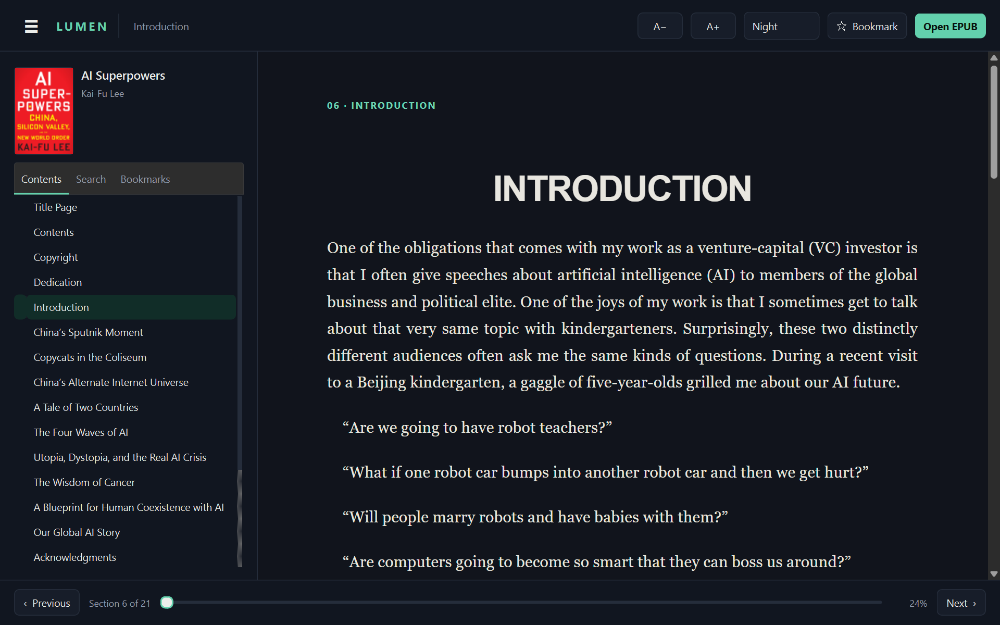
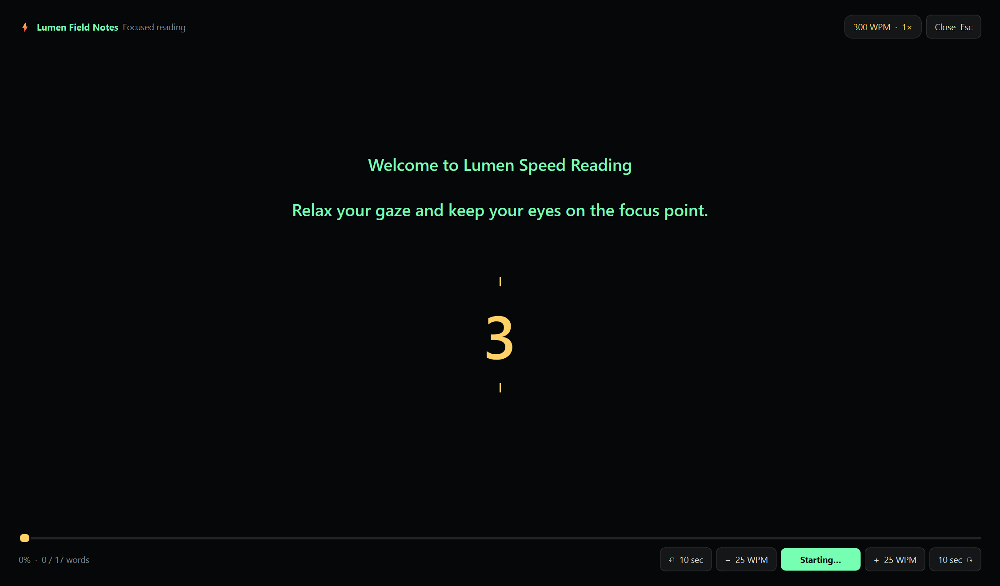

  

<h1 align="center">Lumen Book Reader</h1>

  <strong>A focused desktop reading room for EPUB and PDF—built to help ideas land.</strong>
   
  Faithful pages, deep definitions, durable notes, a spectacular RSVP speed reader,
   
  and a library engine that indexes tens of thousands of books and searches inside them.

  
  
  
  
  

  <a href="#-the-crown-jewel-rsvp-speed-reading">RSVP</a> ·
  <a href="#-definitions-that-understand-the-page">Deep definitions</a> ·
  <a href="#-your-library-indexed-and-searchable">Library engine</a> ·
  <a href="#-ollama-pro-setup">Ollama Pro</a> ·
  <a href="#-install-and-run">Install</a> ·
  <a href="#-documentation">Docs</a>

Lumen gives books a calm native shell without flattening what makes them books. EPUBs stay responsive and themeable. PDFs retain their original typography, color, artwork, rotation, and layout while gaining a transparent selectable text layer for search, quotations, definitions, notes, and speed reading.

| The experience | What Lumen actually does |
|---|---|
| ⚡ **RSVP speed reading** | Presents a book at one stable focus point, starting on the exact word you point at and marking the exact word you stopped on. |
| ◇ **Definitions in context** | Resolves words and phrases with offline, conventional online, inferred, and optional expert sources—without leaving the page. |
| ⟳ **A library that answers** | Indexes the whole shelf across a fleet of processes, then searches titles, authors, and the text *inside* every book in milliseconds. |
| ✦ **Reading memory** | Restores position and keeps searchable notes, quotations, tags, and marks across the whole shelf. |
| 📖 **EPUB + PDF fidelity** | Sanitized, themeable EPUB; high-resolution original-page PDF rendering with aligned selectable text. |

## ⚡ The crown jewel: RSVP speed reading

Lumen’s **Rapid Serial Visual Presentation (RSVP)** player turns the complete text of either an EPUB or PDF into a fixed-focus stream. Press **Ctrl+Shift+R**, tune the session in **Speed Reader Studio**, and Lumen returns you to the corresponding reading position when the session ends.

### ⌖ Start and end markers — new in 1.1.0

RSVP no longer guesses where you meant to begin, and no longer leaves you hunting for where you stopped.

**Point to the first word.** The Studio's confirm button reads **Choose starting word**. Accept it and the live page itself becomes the launcher: a heads-up prompt reads *POINT TO THE FIRST WORD*, a reticle tracks the cursor, and a **START HERE** tag labels whichever word is under it. Click, and the stream begins on exactly that word — not on a fraction of a section estimated from your scroll position. It works on EPUB text and on the PDF selectable layer alike. While targeting is armed the **⚡ Speed** button becomes **✕ Cancel**; <kbd>Esc</kbd> or that button leaves without moving your place, and ordinary clicks are suppressed so nothing on the page can be triggered by accident.

**See where you stopped.** When the session ends, Lumen reopens the page and draws a red marker around the exact final chunk you actually saw, tagged **LAST WORD READ** — or **LAST PHRASE READ** when the chunk size is greater than one. The marker is deliberately transient: <kbd>Esc</kbd>, a click, or a scroll dismisses it, and it is never written into the book or into your marks.

- A welcoming, non-skippable **3 → 2 → 1** transition prepares the eyes before the first word.
- **80–1200 WPM**, **1–5 words per fixation**, and live ±25 WPM adjustment.
- A colored optimal-recognition letter and fixation guides keep the gaze stable.
- Sentence, clause, and long-word timing prevent a mechanically flat rhythm.
- Configurable dark intervals, high-contrast colors, type size, fullscreen, and minimal chrome.
- Optional eye-rest reminders, seekable progress, and roughly ten-second jumps.
- Mouse-wheel movement scrolls the settings page—it never silently changes a field.

| While RSVP is open | Control |
|---|---|
| Pause / resume | <kbd>Space</kbd> or click the word |
| Jump about 10 seconds | <kbd>←</kbd> / <kbd>→</kbd> |
| Change speed by 25 WPM | <kbd>↑</kbd> / <kbd>↓</kbd> |
| Return to page reading | <kbd>Esc</kbd> |

RSVP can be useful for fluent review, but speed and comprehension are not the same thing. Begin conservatively, pause when meaning becomes unclear, and use normal page reading for close study. The rationale, limits, comfort guidance, and research references are in [SpeedReadingToolInLumenReader.md](SpeedReadingToolInLumenReader.md).

## ◇ Definitions that understand the page

Double-click a word, or select a phrase and choose the definition prompt. Lumen runs an append-only, clearly labeled source ladder:

1. bundled Princeton WordNet and the local cache;
2. Wiktionary plus DictionaryAPI.dev, Wikipedia, or Datamuse when appropriate;
3. transparent contextual morphology for coined or inflected expressions;
4. optional Tlamatini Googler evidence;
5. optional **Ollama contextual resolution**, only after conventional sources miss.

That last stage is why Ollama exists in Lumen: **not to chat, summarize the book, or replace a dictionary, but to resolve a difficult definition from the passage being read**. Lumen supplies the selected expression, a bounded surrounding passage, and the current book/section titles; validates the structured answer; and labels the model that produced it.

## ⟳ Your library, indexed and searchable

Lumen keeps a rebuildable index of every book in your library folder, so the shelf can answer questions about thousands of files instantly — including questions about what is *inside* them.

### Searching the shelf

Two modes, side by side above the shelf:

| Mode | Finds |
|---|---|
| **Titles & authors** | Metadata matches, ranked by relevance |
| **Inside books** | Matches in the indexed text of every book, with a highlighted snippet |

Filter chips narrow to **EPUB only** or **PDF only**, results are paged, and the search box speaks full-text query syntax:

| Type this | To get |
|---|---|
| `machine learning` | Books matching both terms |
| `"exact phrase"` | A phrase match |
| `ext:pdf` | A column-qualified term |
| `neural*` | A prefix match |

Diacritics are folded, so *Gödel* finds *Godel*.

### The Turbo Sweep

**⟳ Sweep this folder now** (or <kbd>F5</kbd>) reads every book under the library folder and opens a live monitor while it does. The monitor shows **one tile per extractor process** — its PID, whether it is extracting or publishing, the current book, and how many it has finished — plus books found, successfully committed, already current, unreadable, folders swept, bytes seen, throughput, and an estimate. You can pause it, resume it, stop it, or open the folder it is sweeping.

The sweep is a pipeline, not a sequence of phases. Directory walking, index triage, book extraction and index writing all run at the same time, joined by bounded queues, which means two things that matter on a large or remote library:

- **The fleet starts reading before the walk has finished.** On a slow share that is the difference between minutes of idle cores and none.
- **Memory is set by the queue depths, not by the size of the library.** Nothing in the pipeline holds the file list, so a NAS with millions of books costs the same resident memory as a shelf with a hundred.
- **Progress means committed work.** A result is counted only after SQLite commits it. Malformed PDF metadata is repaired before FTS5 sees it; one unpersistable book becomes an unreadable row without poisoning its batch; a real writer failure stops and joins the fleet, records the failure, and leaves unfinished books for the next sweep instead of hanging at a false percentage.

Books that have not changed since the last sweep are recognised by size and modification time and are never re-read, so a second sweep of an unchanged library costs one walk. Books that have vanished from disk are forgotten when the sweep completes — a setting you can turn off if your library lives on a drive that is not always mounted.

Measured on a real 9,335-book, 15.9 GB library (8,207 EPUB and 1,128 PDF) on a 16-core / 22-thread machine: **9,335 books indexed in about four minutes**, with all 22 extractor processes busy, after which a title search answers in single-digit milliseconds.

### Running on the machine you actually have

Lumen is tuned on a 22-thread workstation with NVMe. **It is not built only for one.** The sweep asks what your machine is before deciding what to run on it, and scales itself down rather than taking the whole computer:

| Your machine | What the sweep does |
|---|---|
| Mechanical (7200 rpm) disk, or a USB / SD card library | **2 extractor processes, 2 walkers, Normal priority.** A spindle has one head and ~100 random IOPS — more readers is measurably *slower*, not faster, and burns cores to be slower. |
| 4 logical processors | **Leaves one core for the reader**, and never runs the fleet above Normal — so the window keeps repainting while the library indexes. |
| 5–8 logical processors | One core kept back, Above-normal priority. |
| Under 8 GB of RAM | A narrower fleet and fewer books held in flight. **The text budget is never reduced** — a slower sweep is a fair trade, a quietly less searchable library is not. |
| A NAS or network share | Up to 8 workers: that is latency rather than seeks, so waiting in parallel genuinely helps. |
| 22 threads and NVMe | One high-priority process per core, exactly as before. |

None of this needs configuring, and none of it is hidden: **Configuration ▸ Sweep engine** prints the machine it detected, the decision it made, and the measurement behind it — *"C: reports a seek penalty: mechanical disk"* — underneath the fleet summary. Every number remains overridable, and an explicit setting is obeyed exactly, even one that is bad for the machine.

There is no GPU requirement, no NVMe requirement, and no minimum core count. Reading a book — opening it, RSVP, definitions, notes, search — never touches any of this; it is the library *sweep* that scales, and it runs in the background with a monitor you can pause or stop.

### Running with or without a GPU

There is one build of Lumen, and it adapts. Extraction and search are replaceable backends rather than inlined code, and both default to **Automatic**: Lumen detects what the machine has — CUDA GPU, the DirectStorage runtime, NVMe — and uses the fastest path that is genuinely available, falling back to the CPU fleet and SQLite FTS5 when it is not. Detection runs in the background at startup, so a machine with no GPU at all never waits for it and never has to be configured differently.

The **Acceleration & scale** tab shows exactly what was detected and, when a faster backend is unavailable, precisely which piece is missing — distinguishing *"no CUDA-capable GPU on this machine"* from *"the hardware is ready, but no kernel is registered in this build"*. **It never claims a GPU is doing work that the CPU is doing.** Today no GPU kernel ships, so both automatic paths resolve to the CPU fleet and SQLite FTS5, and the tab says so.

The design, the schema, the pipeline, the measured numbers, and the current limits are all in **[LibraryEngineInLumenReader.md](LibraryEngineInLumenReader.md)**.

## ⚙ Configuration

Every setting Lumen has lives in one window: press <kbd>Ctrl+,</kbd>, or use **⚙ Configuration** in the header, or **Change folder & settings** on the shelf.

The first control is the one that matters most — **the library folder**. Lumen reads it back from disk as you type and tells you how many books are actually there, so a wrong path is obvious before you save it rather than after a sweep comes back empty. A folder that does not exist is refused rather than saved, and the last twelve libraries you used stay one dropdown away.

| Tab | Covers |
|---|---|
| **Library** | The library folder, what counts as a book, and what to leave out — skipped folders, exclude globs, depth limit, size bounds |
| **Sweep engine** | How many extractor processes and at what priority, how many directory walkers, how deeply each book is read, queue depths, and when Lumen sweeps |
| **Acceleration & scale** | What this machine has, which backends were chosen and why, and how large the index is projected to grow |
| **Index** | Where the database is, how big it is, when it was last swept, optimise and compact, and forgetting libraries whose folder has gone |
| **Search & shelf** | Which mode a search starts in, the debounce, the page size, the snippet width |
| **Reading** | Theme, EPUB type size, sidebar — and pointers to the settings that live in their own windows |

**Save and sweep now** saves everything and starts a sweep in one step.

## ☁ Ollama Pro setup

**Recommended for frequent cloud definitions.** Ollama’s Pro plan currently costs **$20/month or $200/year**, includes larger cloud models, three concurrent cloud models, and 50× the Free cloud allowance. Lumen itself is free and does not require Pro; the subscription is purchased from Ollama. See [Ollama pricing](https://ollama.com/pricing).

### 1. Install Ollama

Download and install the current build from [ollama.com/download](https://ollama.com/download). On Windows, Ollama runs in the background and serves its local API at <code>http://localhost:11434</code>; macOS and Linux are also supported.

Confirm the command is available:

~~~powershell
ollama --version
~~~

### 2. Activate Pro and sign in

Subscribe through [Ollama Pro](https://ollama.com/pricing), then connect the local Ollama application to that account:

~~~powershell
ollama signin
~~~

The browser completes authentication. Lumen never asks for or stores the Ollama password, public key, or API key.

### 3. Pull and verify the cloud model

Lumen’s current default is <code>glm-5.2:cloud</code>:

~~~powershell
ollama pull glm-5.2:cloud
ollama run glm-5.2:cloud
~~~

After the test response, exit the interactive prompt with <code>/bye</code>. <code>ollama ls</code> should now list the cloud tag. Cloud models execute on Ollama’s hosted hardware, so a large local GPU is not required.

### 4. Connect Lumen

1. Start Lumen and select **◇ Definer**.
2. Enable **Ollama only after conventional sources miss**.
3. Keep **Ollama host** as <code>http://127.0.0.1:11434</code>.
4. Select **Discover models**, then choose <code>glm-5.2:cloud</code>.
5. Select **Save definition sources**.
6. While reading, double-click a difficult word or define a selected phrase.

The model list is discovered live because Ollama may retire cloud tags over time. If the default is no longer offered, pull another model from the official [cloud model library](https://ollama.com/search?c=cloud), discover again, and select it.

> **Privacy:** local dictionary and local-model requests stay on the machine. For a cloud model, the selected text, short surrounding context, book title, and section title are processed by Ollama Cloud. Ollama states that prompt/response content is not stored, logged, or used for training; review its current [cloud documentation](https://docs.ollama.com/cloud) and [privacy FAQ](https://docs.ollama.com/faq) before enabling the fallback.

If discovery fails, verify that the Ollama tray application is running, <code>ollama ls</code> works, the host remains local, and no proxy or firewall is blocking port <code>11434</code>.

## ✨ Everything else

- Search the current page or the complete book from the current position, forward or backward.
- Browse nested EPUB navigation or an embedded PDF outline, with page fallback when no outline exists.
- Restore the exact section/page and within-page position.
- Keep notes and reading marks in the portable <code>lumen-reading-marks.json</code> file beside the library.
- Use Night, Paper, or Sepia themes; EPUB text scales from 14–32 px.
- Open password-protected PDFs without persisting the password.
- Recover text from image-only PDFs when optional [Tesseract OCR](https://github.com/tesseract-ocr/tesseract) is installed on <code>PATH</code>.
- Rebuild the index headlessly from a shell with <code>python reindex.py</code>, without opening the reader.
- Scroll precisely with a wheel, touchpad, or touch gesture across the shelf, reader, sidebars, dialogs, and definition cards.

## 🚀 Install and run

Lumen requires Python 3.10 or newer.

~~~powershell
git clone https://github.com/XAIHT/Lumen-Book-Reader.git
cd Lumen-Book-Reader
python -m pip install -e .
lumen-reader
~~~

Or run directly from a checkout:

~~~powershell
python -m pip install -r requirements.txt
python run_reader.py
python run_reader.py "C:\Books\My Book.epub"
~~~

On first run the launch directory becomes the visible shelf. Set the folder you actually keep books in from **⚙ Configuration** (<kbd>Ctrl+,</kbd>) — it is remembered from then on, and the shelf always shows which folder it is displaying. Recently opened books outside it are remembered too. The first sweep builds the index; after that, sweeps are incremental.

### Windows installer

Lumen ships as a per-user Windows release: a wizard, an uninstaller, and the
package they install.

~~~powershell
& "C:/Program Files/Python312/python.exe" .\build_complete_release.py --bump minor
~~~

That single command freezes the app, builds both wizards, assembles
`dist/Lumen_Release_v<version>/` and zips it with SHA-256 checksums and a
release manifest. The user unpacks the zip and double-clicks **Installer.exe**.

The wizard asks four things and nothing else: where Lumen goes, where the
library lives, **which file types to register** — `.epub` and `.pdf` as separate
tick-boxes, with *"make Lumen the default"* as a separate, unticked switch — and
which shortcuts to create. Everything is written under `HKEY_CURRENT_USER`, so
no administrator rights are needed and no other user of the machine is touched.
Every key, shortcut and file it writes is removed by the uninstaller, and
`tests/test_release_scheme.py` fails the build if that stops being true.

Your books are never touched, and reading positions, bookmarks, notes and tags
survive an uninstall unless you explicitly ask for them to go. The library index
is a cache in `%APPDATA%\Lumen Reader` — deleting it costs one sweep and nothing
else.

Full details, including the exact registry surfaces and why each one is there:
**[RELEASING.md](RELEASING.md)**.

> **Before you distribute a binary:** PyMuPDF is offered under AGPL or a
> commercial licence, and the release bundles it. Read
> [THIRD_PARTY_NOTICES.md](THIRD_PARTY_NOTICES.md) first.

### Essential controls

| Action | Keyboard |
|---|---|
| Open a book | <kbd>Ctrl+O</kbd> |
| Configuration — library folder and every setting | <kbd>Ctrl+,</kbd> |
| Sweep the library folder | <kbd>F5</kbd> |
| Search the open book | <kbd>Ctrl+F</kbd> |
| Next / previous page or section | <kbd>Page Down</kbd> / <kbd>Page Up</kbd> |
| Alternate next / previous | <kbd>Ctrl+→</kbd> / <kbd>Ctrl+←</kbd> |
| Start RSVP | <kbd>Ctrl+Shift+R</kbd> |
| Dismiss a definition card, cancel RSVP targeting, or clear the last-word marker | <kbd>Esc</kbd> |
| Mark this position | <kbd>Ctrl+B</kbd> |
| Search all notes and marks | <kbd>Ctrl+Shift+M</kbd> |
| Return to the shelf | <kbd>Alt+←</kbd> |
| EPUB type size / reset | <kbd>Ctrl++</kbd> / <kbd>Ctrl+-</kbd> / <kbd>Ctrl+0</kbd> |
| Follow a book link | <kbd>Ctrl</kbd>+click |

## Trust, storage, and tests

Lumen treats book files as untrusted input. EPUB extraction rejects traversal and oversized payloads, active content is removed, rendered chapters use a restrictive content-security policy, and Chromium cannot navigate the reading surface from an ordinary click. PDF pages are rasterized from the original document, while only their aligned text is made interactive.

Reader state, the definition cache, and the library index use the operating system’s application-data directory. Cross-book notes live in <code>lumen-reading-marks.json</code> beside the library so the reading library remains portable. The index holds only what it needs to answer a search — metadata and a bounded slice of each book’s text — and is rebuildable at any time.

Run the complete regression suite:

~~~powershell
python -m pip install -e ".[test]"
python -m pytest
~~~

**365 tests.** Coverage includes EPUB safety and rendering, PDF fidelity/rotation/passwords/selection, malformed-document Unicode, WordNet and online-response parsing, contextual Ollama payload validation, search order, notes, persistence, wheel-safe settings, responsive non-overlapping reader headers at scaled and narrow window widths, RSVP timing/countdown behavior, the RSVP start/end markers driven against a real Chromium page, commit-accurate sweep progress, partial-sweep prune prevention and presentation, fatal-writer shutdown and recovery, the library index schema and its FTS rowid map, the sweep monitor’s geometry under every fleet and window size, hardware/backend resolution and fallback, the machine profile that sizes the sweep to a four-core laptop with a mechanical disk (injected, not detected, so it is pinned on hardware the test runner does not have), and the release scheme’s install/uninstall symmetry.

## 📚 Documentation

| Document | What it covers |
|---|---|
| **[LibraryEngineInLumenReader.md](LibraryEngineInLumenReader.md)** | The Turbo Sweep pipeline, the index and its schema, search, the acceleration seam, measured numbers, and known limits |
| **[SpeedReadingToolInLumenReader.md](SpeedReadingToolInLumenReader.md)** | The RSVP design: evidence, timing model, markers, configuration reference, and responsible use |
| **[RELEASING.md](RELEASING.md)** | The release pipeline, versioning contract, every registry surface the installer touches, and the install/uninstall mirror |
| **[THIRD_PARTY_NOTICES.md](THIRD_PARTY_NOTICES.md)** | Runtime libraries, bundled lexical data, optional components, online services, and the redistribution checklist |
| **[CHANGELOG.md](CHANGELOG.md)** | What changed in each release |

## License

Lumen’s original code is [MIT licensed](LICENSE). Runtime components and optional integrations retain their own terms. In particular, **PyMuPDF is offered under AGPL or a commercial license**, which may affect redistribution of a packaged application. Read [THIRD_PARTY_NOTICES.md](THIRD_PARTY_NOTICES.md) before distributing binaries.

  <strong>Open a book. Find the meaning. Let the words move.</strong>

